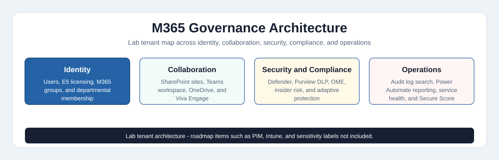

# TechSolutions Inc. — Microsoft 365 Enterprise Deployment
> **Status:** Portfolio Complete — v1.0

### Microsoft 365 Administration Case Study in a Live Lab Tenant

**Md Rahat Islam Anik · Microsoft 365 Administration Case Study · 2026**

[](https://rahatislamanik-spec.github.io/TechSolutions-Microsoft365/)
[](https://linkedin.com/in/rahatislamanik)
[](https://github.com/rahatislamanik-spec)

---

| 300-Employee Scenario | 10 Sample Users | 3 Departments | M365 E5 Lab Tenant | DLP Alert Validated |
|:---:|:---:|:---:|:---:|:---:|

---

## The Brief

TechSolutions Inc. is a representative 300-employee Microsoft 365 deployment scenario. The lab implementation uses 10 sample users across IT, HR, and Marketing to demonstrate the administrative workflow: identity, licensing, collaboration, security controls, DLP validation, monitoring, and automation inside a **live Microsoft 365 lab tenant**.

The screenshots show real portal configuration work performed in a lab tenant. The project is not presented as a production rollout; it is a portfolio case study designed to show Microsoft 365 administrator judgment, documentation, and validation discipline.

---

## Evidence Status

| Area | Status | Evidence |
|---|---|---|
| Bulk user onboarding | Implemented with 10 sample users | CSV import and Admin Center screenshots |
| E5 licensing | Implemented in lab tenant | Active users and license assignment screenshots |
| M365 groups and SharePoint access | Implemented in lab tenant | Group, SharePoint, and Teams screenshots |
| Defender, anti-phishing, Safe Links, Safe Attachments | Configured in lab tenant | Defender policy screenshots |
| DLP policies | Configured and test-alert validated | Purview DLP policy and alert screenshots |
| Insider Risk / Adaptive Protection | Configured as lab policy evidence | Purview screenshots |
| Power Automate reporting | Built as scheduled lab flow | Flow configuration screenshots |
| Sensitivity labels, PIM, Intune | Roadmap | Not implemented in this repo |

For the full screenshot-to-claim map, see [docs/evidence-map.md](docs/evidence-map.md).

---

## Architecture Artifact



This diagram gives a 60-second view of the lab tenant design across identity, collaboration, security, compliance, monitoring, and automation.

[View interactive HTML version](https://rahatislamanik-spec.github.io/TechSolutions-Microsoft365/docs/m365-governance-architecture.html)

---

## Tech Stack

`Microsoft Entra ID` · `Exchange Online` · `SharePoint Online` · `OneDrive for Business` · `Microsoft Defender for Office 365` · `Microsoft Purview` · `DLP` · `Insider Risk Management` · `Adaptive Protection` · `Viva Engage` · `Power Automate` · `Microsoft Secure Score` · `Service Health`

---

## Phase 01 — Identity & Onboarding

> **Building the Foundation** · Bulk onboarding · E5 licensing · M365 Groups · SharePoint permissions

Before a single email is sent or a document shared, the right people need to be in the right places with the right access. Phase 01 established TechSolutions' identity layer from the ground up.

**Bulk User Onboarding via CSV**
The 300-employee scenario was modeled using 10 sample users across three departments — IT, HR, and Marketing — onboarded via structured CSV import through the Microsoft 365 Admin Center. Each sample account was provisioned with UPN, display name, department, and country metadata. At scale, manual account creation is not practical; bulk CSV import demonstrates a repeatable and auditable onboarding pattern.

**Microsoft 365 E5 Licensing**
Every account was assigned an M365 E5 license — the highest tier, unlocking Defender, Purview, Power Automate, and the full compliance stack. Profile pictures were standardized with the TechSolutions company logo across Admin Center, Teams, and Outlook. Department fields, job titles, and contact information were populated tenant-wide.

**Microsoft 365 Groups — Department Structure + Master Group**
Four M365 Groups were created and configured:

```
TechSolutions-IT        → IT department members
TechSolutions-HR        → HR department members
TechSolutions-Marketing → Marketing department members
TechSolutions-All       → All sample users, tenant-wide communications model
```

Each group creation automatically provisions a shared mailbox, SharePoint site, Teams workspace, and Planner — one action, five connected services.

**SharePoint Permissions & Teams Access**
Permissions were configured at group level. The HR group received Full Control on the HR SharePoint site (with Edit-level access for members), and access denial was verified for unauthorized users. The Marketing group was granted rights to create and manage Teams workspaces — confirmed by provisioning a Marketing team and adding all Marketing members.

---

## Phase 02 — Security & Data Protection

> **Locking the Perimeter** · Defender · OME Encryption · DLP · Insider Risk · Adaptive Protection

An M365 tenant needs layered controls across identity, email, data, and collaboration. Phase 02 configured representative security controls for email-borne attacks, phishing, malware handling, unauthorized data sharing, and internal data leak detection.

**Microsoft Defender for Office 365 — Safe Links & Safe Attachments**
Safe Links and Safe Attachments were enabled under Preset Security Policies (Standard and Strict), applied to all inbound email. Safe Links rewrites every URL at time-of-click against Microsoft's threat intelligence database in real time. Safe Attachments detonates suspicious files in a sandbox before delivery. Extended protection was configured across Teams and Office 365 Apps with click-tracking enabled.

**Anti-Phishing — Mailbox Intelligence & Spoof Protection**
Anti-phishing was configured through Defender's Threat Policies. Mailbox intelligence and spoof intelligence were both enabled, allowing Defender to learn normal sending patterns and flag anomalies. Phishing threshold set to Standard. Zero impersonated domains or users detected in the 7-day post-configuration window — confirming a clean baseline.

**Microsoft 365 Message Encryption — Automatic Internal Email Encryption**
A mail flow rule was configured in the Exchange Admin Center to automatically apply Microsoft 365 Message Encryption (OME) to all internal-to-internal emails. The rule — *"Encrypt All Internal Emails"* — was enabled and confirmed active. Every communication between TechSolutions employees is encrypted in transit with no action required from the sender.

**Data Loss Prevention — Canadian PII & Financial Data**
Two DLP policies were created in Microsoft Purview targeting the highest-risk data types for a Canadian organization:

- **Canadian PII policy** — Social insurance numbers, health card numbers, and personal identifiers
- **Financial data policy** — Credit card numbers and banking data

Both policies were set to active and live-tested. An email containing test credit card data immediately triggered a high-severity DLP alert in Microsoft Purview, with a `DlpRuleMatch` event logged in the audit trail — real-time detection confirmed.

**Insider Risk Management & Adaptive Protection**
A Data Leaks quick policy was deployed in Microsoft Purview covering all active users, with DLP policies integrated as policy indicators. Adaptive Protection was enabled to dynamically tighten Conditional Access controls based on user risk score — automatically restricting Office app access for elevated-risk users without manual admin intervention. This is risk-based security that responds to behaviour, not just policy.

**Microsoft Secure Score — Baseline Review**
The Secure Score dashboard was reviewed post-configuration to assess TechSolutions' overall security posture. The score reflected the cumulative effect of all protections deployed across identity, data, and collaboration — with recommended improvement actions flagged for ongoing hardening.

---

## Phase 03 — Collaboration & Governance

> **Building the Workspace** · SharePoint · OneDrive · Viva Engage · Document Lifecycle

Productivity without structure creates chaos. Phase 03 stood up the full collaboration infrastructure with the right permissions, retention rules, and governance controls across every service.

**SharePoint Online — Departmental Sites & Permission Tiers**
Three dedicated SharePoint team sites were provisioned — TechSolutions IT, HR, and Marketing. Each site has its own permission structure:

| Site | Owners | Members | External |
|---|---|---|---|
| IT | Full Control | Edit | Locked |
| HR | Full Control | Edit only | Locked |
| Marketing | Full Control | Edit | Locked |

The HR site is the most restrictive — access denied response verified for any user outside the HR group attempting to browse.

**HR Document Library — Versioning & Content Approval**
A dedicated HR Documents Library was configured with two critical governance controls:

- **Document versioning** — full edit history preserved for every HR document
- **Content approval** — HR owners must approve any new or modified document before it becomes visible to members
- **Draft item security** — draft visibility restricted to authors and approvers only

**OneDrive for Business — External Sharing Restriction & Retention Policies**
Organization-wide OneDrive external sharing was restricted to *"Only people in your organization"* for the lab tenant. Two retention policies were applied:

- **5-year retention policy** — all OneDrive files retained for long-term compliance
- **1-year deletion policy** — stale files automatically moved to Recycle Bin after 12 months of inactivity

**Viva Engage — Internal-Only Communities**
Viva Engage was configured as TechSolutions' enterprise social network with a strict internal-only policy — all activity restricted to authenticated tenant users only. Four communities were created and confirmed:

```
Company-Wide Announcements  → All sample users
TechSolutions-IT            → IT department
TechSolutions-HR            → HR department
TechSolutions-Marketing     → Marketing department
```

Internal-only policy saved and verified with confirmation banner.

---

## Phase 04 — Monitoring & Automation

> **Keeping the Lights On** · Audit Logs · Alert Policies · Service Health · Power Automate

A deployed environment without visibility is a liability. Phase 04 instrumented the entire TechSolutions tenant so IT administrators can see everything that matters without having to look for it.

**Audit Logging — Custom Search in Microsoft Purview**
Audit logging was enabled across the tenant. A custom audit log search was configured to track SharePoint file activity — access, uploads, edits, and deletions — for specific users within defined date ranges. This gives IT administrators the ability to reconstruct any user action in SharePoint and meet the forensic requirements of a compliance investigation.

**Alert Policies — Suspicious Activity & DLP Breach Notifications**
A Suspicious File Activity alert policy was created to notify administrators when anomalous file access patterns are detected. Separate DLP breach notifications were configured to fire on every DLP policy match. Alert coverage configured:

- Multiple failed login attempts
- Mass file deletion
- DLP policy breaches
- High-severity insider risk events
- Unresolved policy warnings

Severity, threshold, and recipient list configured and policy confirmed active.

**Power Automate — Automated Monthly Usage Reports**
A scheduled Power Automate cloud flow was built and deployed to automatically generate and deliver monthly M365 usage reports to IT administrators and department heads. The flow:

1. Runs on monthly recurrence
2. Retrieves the previous 30 days of Microsoft 365 activity data
3. Formats the data as CSV
4. Emails the report to the distribution list

Coverage: email activity, SharePoint usage, and security events. Flow tested and confirmed active.

**Service Health Monitoring**
Service Health email alerts were enabled to automatically notify administrators of any M365 service incidents, advisories, or degradations. All services confirmed healthy post-deployment: Exchange Online, OneDrive, SharePoint, Teams, and Viva Engage. IT department team members were added as additional notification recipients alongside the global admin — no incident goes unnoticed.

**Final Secure Score Review**
With all four phases complete, the Secure Score dashboard was reviewed as the final validation checkpoint. The score provided a baseline view of the lab tenant's security posture and highlighted additional hardening actions for future improvement.

---

## Skills Demonstrated

| Domain | What Was Configured |
|---|---|
| **Identity & Access** | Bulk user onboarding, M365 Groups, RBAC, SharePoint permission tiers, Entra ID |
| **Email Security** | Safe Links, Safe Attachments, Anti-Phishing, OME encryption, Exchange mail flow rules |
| **Data Loss Prevention** | Canadian PII policies, credit card detection, live alert verification, DLP-IRM integration |
| **Compliance & Governance** | Retention policies, content approval, document versioning, audit log search, Purview |
| **Insider Risk** | Data leaks policy, Adaptive Protection, Conditional Access integration, risk-based controls |
| **Collaboration Tools** | SharePoint Online, OneDrive governance, Viva Engage communities, Microsoft Teams |
| **Automation** | Power Automate scheduled flows, usage reporting workflow design |
| **Monitoring** | Custom audit searches, alert policies, service health monitoring, Secure Score tracking |

---

## What's Next — Phase 05 Roadmap

The foundation is in place. These are the logical next steps to complete TechSolutions' information protection framework:

**Sensitivity Labels** — Apply Public, Internal, Confidential, and Highly Confidential labels across documents and emails. Auto-labelling policies to classify HR and financial data without user action.

**Microsoft Entra PIM** — Privileged Identity Management for just-in-time admin role activation. Global Administrator access time-bound and approval-gated — least privilege enforced at the highest level.

**Microsoft Intune** — Enroll TechSolutions endpoints into Intune. Deploy compliance policies, app protection policies, and Defender for Endpoint across all managed devices.

---

## Live Case Study

The full interactive case study — with phase-by-phase documentation and live-tenant screenshots — is published at:

**[rahatislamanik-spec.github.io/TechSolutions-Microsoft365](https://rahatislamanik-spec.github.io/TechSolutions-Microsoft365/)**

---

> *This case study documents a Microsoft 365 lab tenant configured by one administrator to model identity, collaboration, security, compliance, monitoring, and reporting workflows for a 300-employee organization.*

---

## Author

**Md Rahat Islam Anik**
Microsoft 365 · Entra ID · Cloud Administration · May 2026

[](https://linkedin.com/in/rahatislamanik)
[](https://github.com/rahatislamanik-spec)
